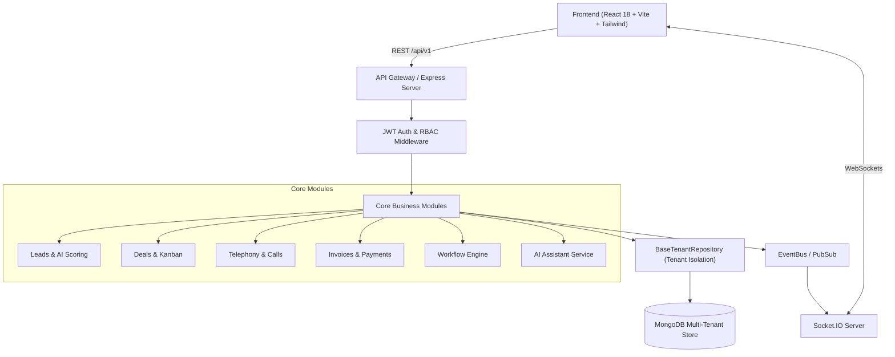

# ⚡ ADVMEN SalesOS — Enterprise Multi-Tenant Sales & RevOps CRM

An enterprise-grade, multi-tenant Sales Management & Revenue Operations platform built with a high-performance **React + TypeScript** frontend and an isolated, secure **Node.js + Express + MongoDB** backend.

---

## 🌟 Key Highlights

- 🏢 **Multi-Tenant Architecture**: Strict organizational isolation at database and application layers.
- 👥 **Granular RBAC (7 Roles)**: Purpose-built dashboards and permissions for Super Admin, Org Admin, Sales Manager, Sales Rep, SDR/Marketing, Telecaller, and Finance Viewer.
- ⚡ **Realtime Event Streaming**: Powered by WebSockets (Socket.IO) for instant deal updates, telephony alerts, and notification streams.
- 🤖 **AI-Powered Intelligence**: Automated lead qualification scoring, AI conversation summaries, and smart cold email/proposal drafting.
- 🛡️ **Resilient API Architecture**: Request correlation IDs (`X-Request-Id`), HTTP-only cookie authentication with silent token refresh, circuit breakers, and automatic fallback handling.
- 📊 **Interactive Visual Workflows**: Drag-and-drop Kanban pipeline, call dialer simulator, quote/proposal generator, invoice reconciliation, and rule-based workflow automation.

---

## 🏗️ System Architecture



---

## 📦 Core Modules & Features

### 1. 🎯 Lead Management & AI Scoring
- Inbound lead capture with activity timeline tracking (calls, emails, notes).
- Dynamic algorithmic + AI lead qualification score (0–100 scale) with priority categorizations (`HOT`, `WARM`, `COLD`).
- One-click AI lead profile and interaction summarization.

### 2. 💼 Deal Pipeline & Visual Kanban
- Multi-stage interactive deal board (`Lead In`, `Contact Made`, `Demo Scheduled`, `Proposal Sent`, `Negotiation`, `Won`, `Lost`).
- Drag-and-drop stage progression with real-time revenue weighting and win probability forecasting.
- Single-click transition from qualified lead to high-value deal.

### 3. 📞 Calls & Telephony Center
- In-browser telephony workflow with call disposition tagging (`Interested`, `Follow-up Required`, `Voicemail`, `Do Not Call`).
- Call duration tracking, recordings archive interface, and real-time telecaller performance metrics.

### 4. 📄 Proposals & Quotes
- Proposal lifecycle builder (`Draft`, `Sent`, `Viewed`, `Accepted`, `Rejected`).
- Line-item breakdown, discount controls, tax computation, and digital client delivery.

### 5. 💳 Invoicing & Payment Reconciliation
- Integrated multi-currency invoice creation and tracking (`Pending`, `Paid`, `Overdue`, `Cancelled`).
- Webhook-ready payment provider integration (Stripe / Razorpay) for automated status reconciliation.

### 6. ⚙️ Workflow Automation Engine
- Rule-based triggers (e.g., `lead.created`, `deal.stage_changed`, `payment.received`).
- Conditional action execution (automatic email dispatch, task assignment, webhook web-calls).

### 7. 🛡️ Role-Based Personas & Custom Dashboards
- **Super Admin**: Platform-wide organizational controls, subscription tiers, and system health metrics.
- **Org Admin**: User provisioning, role assignment, and audit logs.
- **Sales Manager**: Team leaderboard, pipeline velocity, quota tracking, and team deal conversion rates.
- **Sales Rep**: Personal pipeline, commission tracker, task calendar, and follow-up queues.
- **SDR / Marketing**: Lead enrichment, campaign conversion analytics, and cold outreach.
- **Telecaller**: Call dialer queue, call quotas, and disposition tracking.
- **Finance Viewer**: Read-only revenue analytics, invoice settlement logs, and cash flow summaries.

---

## 🛠️ Technology Stack

### Frontend
- **Framework**: React 18, Vite, TypeScript
- **Styling**: Tailwind CSS, Custom Glassmorphism Design Tokens (`tokens.css`)
- **State Management**: Zustand (Session & UI State)
- **Icons & UI**: Lucide React
- **Networking**: Resilient Fetch Client with Silent Refresh & WebSocket integration

### Backend
- **Runtime**: Node.js, Express, TypeScript
- **Database**: MongoDB with Mongoose ODM (Multi-Tenant Scoped Schema)
- **Realtime**: Socket.IO
- **Security**: Helmet, CORS, Rate Limiting, HTTP-Only Cookie JWTs, AsyncLocalStorage Context
- **Testing**: Jest, Supertest, Playwright (E2E)

---

## 🚀 Quick Start Guide

### Prerequisites
- [Node.js](https://nodejs.org/) (v18.x or higher)
- [MongoDB](https://www.mongodb.com/) (Local instance or [MongoDB Atlas URI](https://www.mongodb.com/atlas))

---

### 1. Clone the Repository
```bash
git clone https://github.com/Pr4tyushMishra/sales_management_system.git
cd sales_management_system
```

---

### 2. Backend Setup
```bash
cd Backend

# Install dependencies
npm install

# Setup environment variables
cp .env.example .env

# Edit .env and configure your MONGODB_URI & JWT secrets
# Start the development server
npm start
```
> Backend will be running at: `http://localhost:5001`

---

### 3. Frontend Setup
```bash
cd ../Frontend

# Install dependencies
npm install

# Setup environment variables
cp .env.example .env

# Start the Vite development server
npm run dev
```
> Frontend will be running at: `http://localhost:3000`

---

## ⚙️ Environment Variables Reference

### Backend (`Backend/.env`)
| Variable | Description | Default / Example |
| :--- | :--- | :--- |
| `PORT` | API Server Port | `5001` |
| `NODE_ENV` | Environment mode | `development` |
| `CLIENT_URL` | Frontend origin for CORS | `http://localhost:3000` |
| `JWT_ACCESS_SECRET` | Secret key for access tokens | `your_access_secret_key` |
| `JWT_REFRESH_SECRET` | Secret key for refresh tokens | `your_refresh_secret_key` |
| `MONGODB_URI` | MongoDB Connection String | `mongodb://localhost:27017/salesos` |
| `OPENROUTER_API_KEY` | (Optional) AI Model API Key | `sk-or-...` |

### Frontend (`Frontend/.env`)
| Variable | Description | Default / Example |
| :--- | :--- | :--- |
| `VITE_API_BASE_URL` | Target Backend API Base URL | `http://localhost:5001/api/v1` |

---

## 🧪 Testing

```bash
# Run Backend Unit & Integration Tests
cd Backend
npm test

# Run E2E Journeys
cd ../Frontend
npm test
```

---

## 📄 License
This project is open-source and available under the [MIT License](LICENSE).
